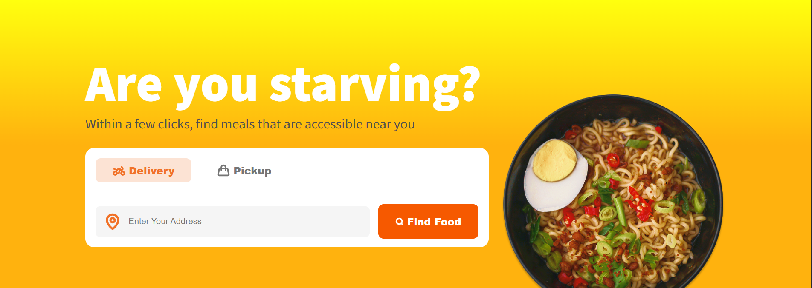

# 🍔 Food Wagon - Delivery Landing Page

A modern, responsive landing page for a food delivery service, built based on a professional Figma design.

## 🚀 Live Demo
You can view the live website here: [Live Demo Link](https://omiddarzi.github.io/food-delivery-landing-page/)

## ✨ Features
- **Fully Responsive:** Optimized for desktop, tablet, and mobile screens.
- **Pixel Perfect:** Developed with close attention to the original Figma design.
- **Clean Code:** Structured HTML5 and organized CSS3.
- **Modern UI:** Includes hover effects and clean typography.

## 🛠️ Technologies Used
- **HTML5:** For semantic structure.
- **CSS3:** For styling and layouts (Flexbox/Grid).
- **Google Fonts:** For modern typography.

## 📸 Preview

## ✍️ Author
- **Omid Darzi** - [Your GitHub Profile](https://github.com/omiddarzi)
